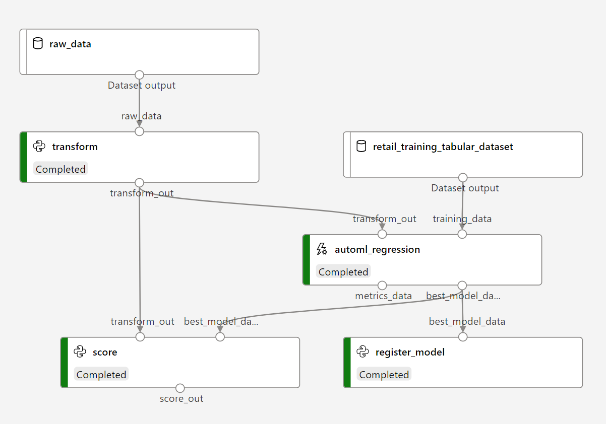
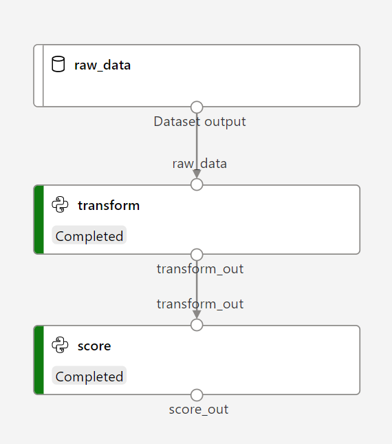
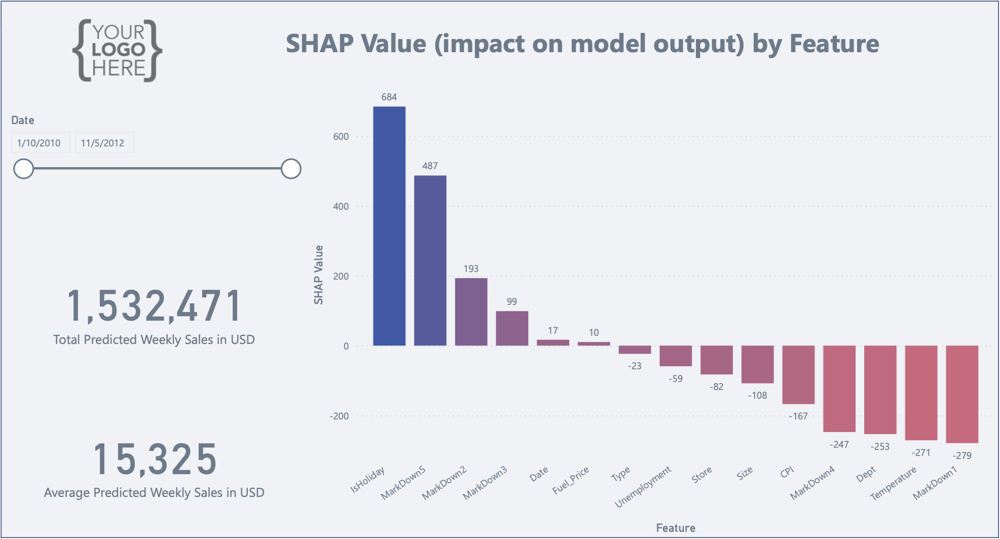

# Introduction 
Azure Machine Learning's automated ML capability helps you discover high-performing models without you reimplementing every possible approach. Combined with Azure Machine Learning pipelines, you can create deployable workflows that can quickly discover the algorithm that works best for your data. This project will show you how to efficiently join a data preparation step to an automated ML step. Automated ML can quickly discover the algorithm that works best for your data, while putting you on the road to MLOps and model lifecycle operationalization with pipelines.

# Machine Learning Pipelines
* Training pipeline:

    

* Scoring pipeline:
    
    

# Prerequisites

* An Azure subscription. If you don't have an Azure subscription, create a free account before you begin. Try the [free or paid version of Azure Machine Learning](https://azure.microsoft.com/free/) today.

* An Azure Machine Learning workspace. See [Create an Azure Machine Learning workspace](https://docs.microsoft.com/en-us/azure/machine-learning/how-to-manage-workspace?tabs=python).  

* Familiarity with Azure's [automated machine learning](https://docs.microsoft.com/en-us/azure/machine-learning/concept-automated-ml) and [machine learning pipelines](https://docs.microsoft.com/en-us/azure/machine-learning/concept-ml-pipelines) facilities and SDK.

# Getting Started
1. Setup a local conda environment.

    > ! Note: replace myenv with the environment name.
    - Create a new environment from an env.yaml file:

        `> conda env create --name myenv --file env.yaml`
    
        OR:
    - Update an existing environment:

        `> conda env update --name myenv --file env.yaml`

2. Configure your workspace settings in [config.json](config.json).

    ```
    {
    "subscription_id": "my_subscription_id",
    "resource_group": "my_resource_group",
    "workspace_name": "my_workspace_name",
    "tenant_id": "my_tenant_id",
    "compute_name": "my_compute_cluster",
    ...
    }
    ```

3. Register initial training dataset in [transform.py](src/training_pipes/transform/transform.py).
    ```
    training_tabular_dataset = Dataset.Tabular.register_pandas_dataframe(
            dataframe=train_df,
            target=workspaceblobstore,
            name=args.dataset_name,
            show_progress=True)
    ```

4. Run your automated ML training pipeline.

    ```
    > cd project_directory
    > python training_main.py
    ```

5. Run your scoring pipeline.

    ```
    > cd project_directory
    > python scoring_main.py
    ```

# Reports
1. Install Power BI Desktop.

    To download Power BI Desktop, go to the [Power BI Desktop download page](https://powerbi.microsoft.com/desktop) and select Download Free. Or for download options, select [See download or language options](https://www.microsoft.com/download/details.aspx?id=58494).

    Note: Power BI requires that you use a work or school email address. You can't sign up or purchase using email addresses provided by consumer email services or telecommunication providers. This includes outlook.com, hotmail.com, gmail.com, and others. If you don't have a work or school account, [learn about alternate ways to sign up](https://docs.microsoft.com/en-us/power-bi/enterprise/service-admin-signing-up-for-power-bi-with-a-new-office-365-trial).

2. Open [shap.pbit](reports/shap.pbit) and connect to data.

3. Summarize the effects of all the features.

    To get an overview of which features are most important for a model we can plot the SHAP values of every feature for every sample. The plot below sorts features by the sum of SHAP value magnitudes over all samples, and uses SHAP values to show the distribution of the impacts each feature has on the model output. The color represents the SHAP value (red negative, blue positive).

    

# Getting Help
This project is under active development by Alvin Haryanto.

If you have questions, comments, or just want to have a good old-fashioned chat about MLOps with Azure Machine Learning, please reach out to me at haryanto.alvin@gmail.com, alvin.haryanto@avanade.com, or [linkedin.com/in/alvinharyanto](https://www.linkedin.com/in/alvinharyanto).