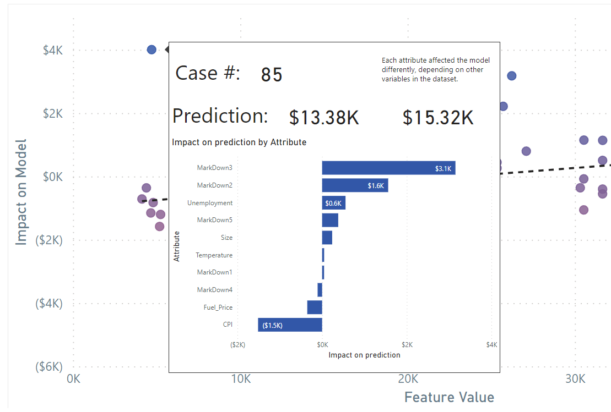
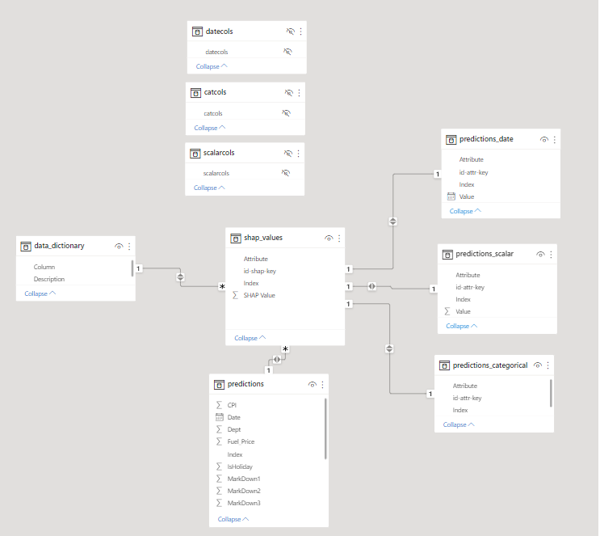
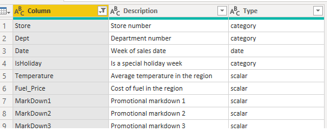

# Advanced Model Explanation in Power BI

by [William Harding](https://github.com/BillmanH)

Azure Machine Learning uses [SHapley Additive exPlanations](https://github.com/slundberg/shap?msclkid=47f41184ae1f11ec86a1f83ddecfce09) to explain model performance, but does a poor job of rendering and making use of this information. The `Model Explanation Power BI.pbit` loads the outputs of the training run, but loads it in a way that allows for interactive exploration of your results. 

**Note** that this is configured for an analysis of a regression problem, but for a logistic regression it would have to be configured differently. 



It includes a detailed tooltip that will allow you to examine each casse and look at how each feature contributed to that ourcome. 

It also has separate layouts for categorical and date data types

## Data Model for DIY chart building

The goal is to have a model that you can easily drag and drop into new charts. This pattern will allow you to filter using `feature`, `index` and pull up and aggregate the shap values AND the prediction values in either direction. 




## Easy input

You should be able to load any model run output so long as it conforms to the input dataset. The terms are meant to be ambiguous so you should be able to just select a new dataset and hit refresh. 

**A note about PowerBI**: Power BI, by design, hard codes values in it's loading script. This means that you will need to reset your column names if the columns in your dataset have different names. 

Take this example:
```
= Table.TransformColumnTypes(#"Promoted Headers",{{"Store", Int64.Type}, {"Dept", Int64.Type}, {"Date", type text}, {"IsHoliday", Int64.Type}, {"Temperature", type number}, {"Fuel_Price", type number}, {"MarkDown1", type number}, {"MarkDown2", type number}, {"MarkDown3", type number}, {"MarkDown4", type number}, {"MarkDown5", type number}, {"CPI", type number}, {"Unemployment", type number}, {"Type", type text}, {"Size", Int64.Type}, {"Weekly_Sales_Prediction", type number}})
```
If you change your dataset you will need to collect these column types again. You can do this just by hitting the "detet column types". There is no function like `do xyz for each col in columns`. Aside from this I've made the data so that it would load quick and easily. 

## Set the column types
SHAP has different ways of looking at scalar values than categorical values. You can't have string values in a scatter plot, so they are separated to show them on different pages. These are important because otherwise the model won't be able to break them up. 
* category
* date
* scalar

In the sheet `data_dictionary.csv` set the column types (the conlumn names are required). 


This will automatically sort the values so that the SHAP tables can render them correctly. 